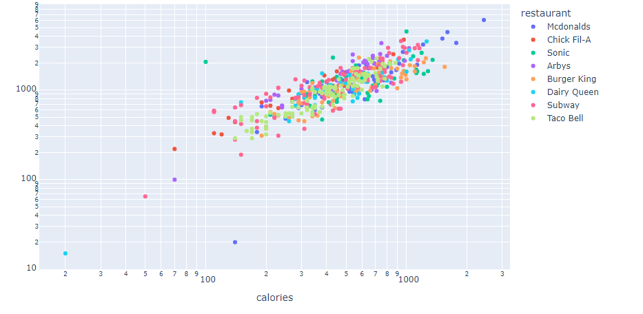
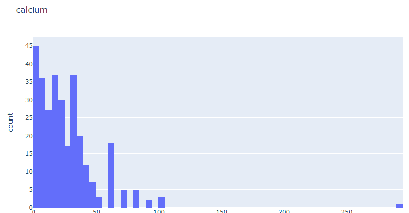
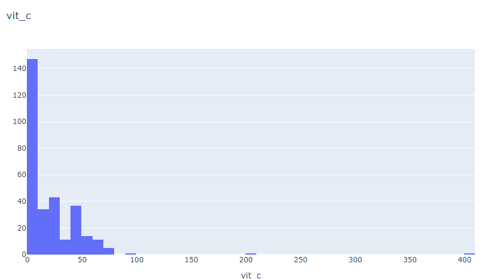
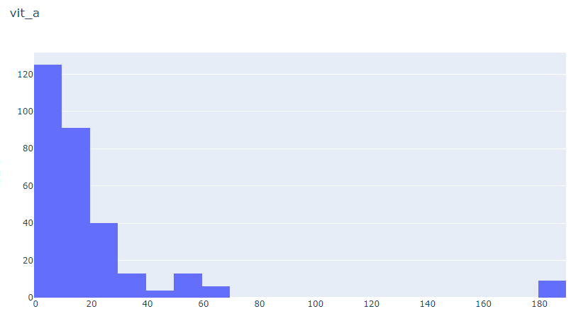
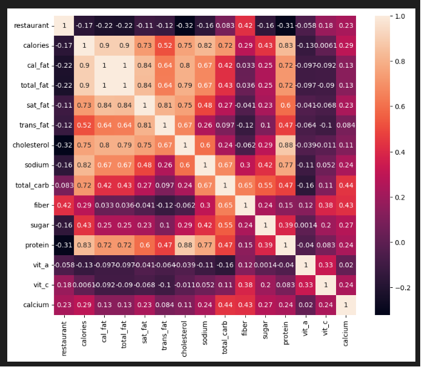
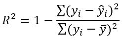

# Laporan Proyek Machine Learning

### Nama : Salma Aulia

### Nim : 211351134

### Kelas : TIF Pagi A

## Domain Proyek


Menghitung kalori pada makanan yang kita konsumsi sangatlah penting untuk kesehatan kita. Berbagai macam penyakit bisa muncul jika kita tidak mengendalikan jumlah kalori yang masuk kedalam tubuh kita seperti diabetes, obesitas, penyakit jantung, kolesterol, dll. Oleh sebab itu menghitung jumlah kalori yang masuk kedalam tubuh kita sangatlah penting.

Modern ini, makanan yang mudah untuk kita jumpai adalah makanan cepat saji atau fast food. Restoran cepat saji sangat mudah kita jumpai diberbagai tempat. Oleh karena itu kita harus dapat menghitung jumlah kalori yang masuk pada makanan fast-food. Dengan perkembangan teknologi informasi saat ini, kita dapat membuat suatu program machine learning yang dapat menghitung jumlah kalori pada makanan fast-food

## Business Understanding

### Problem Statements

- Makanan fast-food yang mudah ditemukan tidak menyertai informasi tentang jumlah nutrisi yang terkandung.
- Jumlah kalori yang masuk kedalam tubuh kita harus dikontrol untuk menghindari penyakit yang berpotensi muncul.

### Goals

- Konsumen dapat mengetahui angka kalori dari suatu makananan khususnya fast-food berdasarkan beberapa faktor.

### Solution statements

- Membangun suatu sistem yang dapat mempelajari suatu data (Machine Learning) melakukan estimasi angka kalori suatu makanan
- Sistem berjalan dengan menggunakan metode Regresi Linear yang dinilai cocok untuk melakukan estimasi.

## Data Understanding

Dataset yang digunakan berasal dari situs Kaggle. Dataset ini mengandung 503 entries dan 16 columns<br>

Link Dataset: [Dataset Kalori Fast-food](https://www.kaggle.com/datasets/sujaykapadnis/fast-food-calories-data/data).

### Variabel-variabel yang terdapat pada Dataset adalah sebagai berikut:

- restaurant : Nama Restaurant
- item : Nama makanan
- calories : jumlah kalori pada makanan
- cal_fat : jumlah kalori dari lemak pada makanan
- total_fat : total lemak pada mkanan.
- sat_fat : Angka lemak jenuh pada makanan.
- trans_fat : Angka lemak trans (lemak yang terbentuk ketika minyak menjadi padat) pada makanan.
- cholesterol: angka kolesterol pada makanan.
- sodium: angka sodium pada makanan.
- total_carb: total karbohidrat pada makanan.
- fiber: angka fiber pada makanan.
- sugar: angka gula/glukosa pada makanan.
- Protein: angka protein pada makanan.
- vit_a :angka vitamin A pada mkanan
- vit_c : angka vitamin B pada makanan
- calcium : angka kalsium pada makanan.

  
    
    
    

## Data Preparation

Pertama-tama import semua library yang dibutuhkan,

```bash
import pandas as pd
import numpy as np
import matplotlib.pypot as plt
import seaborn as sns
```

Setelah itu kita akan men-definsikan dataset menggunakan fungsi pada library pandas

```bash
df = pd.read_csv('fastfood_calories.csv')
pd.set_option('display.max_columns', None)
```

Lalu kita akan melihat informasi mengenai dataset dengan syntax seperti dibawah:

```bash
df.info()
```

Dengan hasil sebagai berikut:

```bash
<class 'pandas.core.frame.DataFrame'>
RangeIndex: 515 entries, 0 to 514
Data columns (total 18 columns):
 #   Column       Non-Null Count  Dtype
---  ------       --------------  -----
 0   Unnamed: 0   515 non-null    int64
 1   restaurant   515 non-null    object
 2   item         515 non-null    object
 3   calories     515 non-null    int64
 4   cal_fat      515 non-null    int64
 5   total_fat    515 non-null    int64
 6   sat_fat      515 non-null    float64
 7   trans_fat    515 non-null    float64
 8   cholesterol  515 non-null    int64
 9   sodium       515 non-null    int64
 10  total_carb   515 non-null    int64
 11  fiber        503 non-null    float64
 12  sugar        515 non-null    int64
 13  protein      514 non-null    float64
 14  vit_a        301 non-null    float64
 15  vit_c        305 non-null    float64
 16  calcium      305 non-null    float64
 17  salad        515 non-null    object
dtypes: float64(7), int64(8), object(3)
memory usage: 72.5+ KB
```

<br>

Kita juga akan melihat tingkat korelasi antar kolom



Korelasi antar kolom perlu diperhatikan guna memilih feature dengan tepat. Dari data diatas, nilai dengan korelasi tertinggi adalah cal_fat, total_fat, sat_fat, trans_fat, cholesterol, sodium, total_carb, protein

Selanjutnya memeriksa apakah ada data yang berisi nilai null pada dataset:

```bash
df.isna().sum()
```

Dengan hasil sebagai berikut:

```bash
Unnamed: 0       0
restaurant       0
item             0
calories         0
cal_fat          0
total_fat        0
sat_fat          0
trans_fat        0
cholesterol      0
sodium           0
total_carb       0
fiber           12
sugar            0
protein          1
vit_a          214
vit_c          210
calcium        210
salad            0
dtype: int64
```

 <br>

Terdapat beberapa label yang memiliki nilau Nan atau null, sehingga perlu adanya data cleansing

### Mengisi nilai NaN atau null pada dataset

berikut adalah code yang digunakan untuk mengisi nilai NaN pada dataset. Untuk mengisi nilai NaN menggunakan fungsi fillna() dan kita akan mengisi value NaN tersebut dengan mean dari kolom tersebut

```bash
df.dropna(subset=['protein','fiber'],inplace=True)
columns_to_fill = ['vit_a', 'vit_c', 'calcium']

# Fill null values in the specified columns with the mean
df[columns_to_fill] = df[columns_to_fill].fillna(df[columns_to_fill].mean())
```

Berikut adalah hasil dari cleansing dataset

```bash
restaurant     0
item           0
calories       0
cal_fat        0
total_fat      0
sat_fat        0
trans_fat      0
cholesterol    0
sodium         0
total_carb     0
fiber          0
sugar          0
protein        0
vit_a          0
vit_c          0
calcium        0
dtype: int64
```

### Membuat feature

Setelah seluruh kolom bertipe data integer dan sudah tidak memiliki nilai NaN, maka kita dapat membuat fitur dari kolom-kolom tersebut.
Feature digunakan sebagai parameter menghitung hasil estimasi/prediksi yang diharapkan. Hasil estimasi di dataset ini adalah kolom calories. Untuk membuat feature dan target dengan codingan sbgai berikut:

```bash
features = ['cal_fat','total_fat','sat_fat','trans_fat','cholesterol','sodium','total_carb','protein']
x = df[features]
y = df['calories']
x.shape, y.shape
```

### Split Dataset untuk Training dan Testing

Ketika akan melakukan proses perhitungan dengan metode regresi linear, maka dataset harus dibagi menjadi dua jenis yaitu training dan testing. Split dataset menggunakan fungsi train_test_split.

```bash
from sklearn.model_selection import train_test_split
x_train, x_test, y_train, y_test = train_test_split(x,y,random_state=34,test_size=0.1)
y_test.shape
x_train.shape
```

Disini kita mendapatkan 452 data untuk data training, dan 51 data untuk data
tesing.

## Modeling

Pada tahap modeling, kita akan menggunakan metode Regresi Linear yang sudah kita import melalui library sklearn.

```bash
from sklearn.linear_model import LinearRegression
lr = LinearRegression()
lr.fit(x_train,y_train)
pred = lr.predict(x_test)
```

Lalu berikut adalah skor akurasi dari model yang kita buat

```bash
score = lr.score(x_test,y_test)
print('Akurasi model Regresi Linear', score)
```

> Akurasi model Regresi Linear 0.9990714538624441

## Evaluation

Metrik evaluasi yang digunakan adalah **RMSE** dan **R2**,
**RMSE** adalah singkatan dari **Root Mean Square Error**.
Metrik ini menghitung perbedaan antara nilai aktual dan nilai prediksi, kemudian menghitung akar kuadrat dari rata-rata selisih kuadrat tersebut. Semakin kecil nilai RSME, semakin baik kualitas model regresi tersebut. Metode **R-square** ini merupakan metode yang paling sering digunakan. Metode ini akan memberikan bobot sangat tinggi untuk kesalahan absolut besar. Oleh karena itu, nilai R2 yang




Mari kita implementasi metrik evaluasi R-Square dan RSME pada model yang telah kita bangun:

```bash
from sklearn.metrics import r2_score
from sklearn.metrics import mean_squared_error

print('R2:', r2_score(y_test,pred))
print('RMSE:', np.sqrt(mean_squared_error(y_test, pred)))
```

> R2: 0.9990714538624441
> RMSE: 7.857544128611455

Didapatkan hasil **R2** sebesar RR2: 0.9990714538624441 dan **RMSE** sebesar 7.857544128611455. Dengan hasil seperti itu maka model yang kita gunakan sudah cukup layak.

## Deployment

Link Streamlit: https://app-estimasi-kalori-6uvtqhsrumxwehtryvvznc.streamlit.app/
